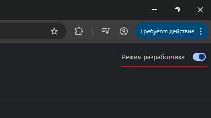
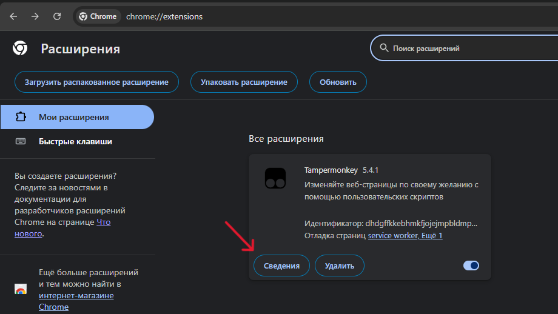
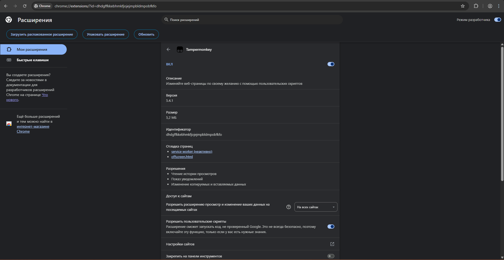
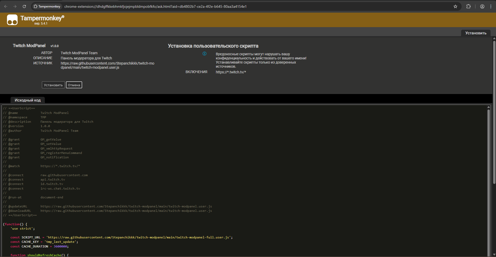
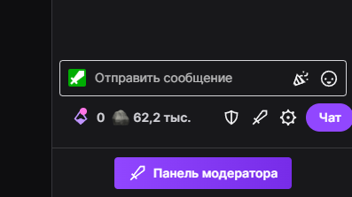
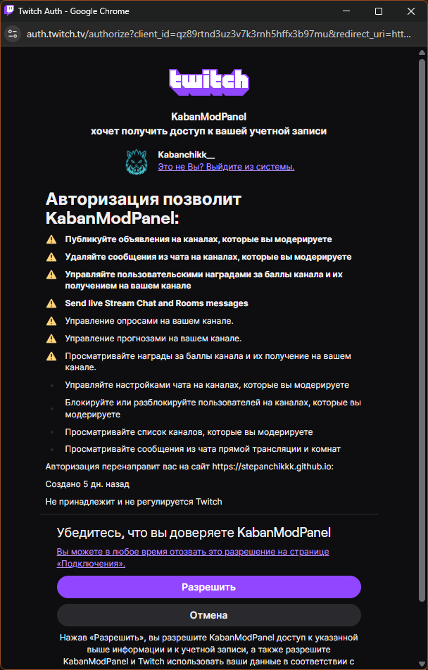
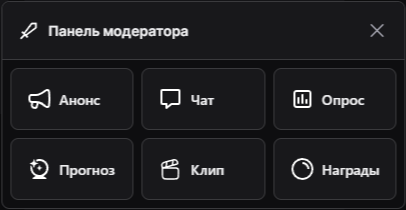

# 🛡️ Twitch ModPanel

Панель модератора для Twitch — быстрый доступ к инструментам управления стримом без переключения на Mod View.

---

## 📦 Установка

### Способ 1: Tampermonkey (рекомендуется)

#### Шаг 1. Установи Tampermonkey

1. Открой сайт [tampermonkey.net](https://www.tampermonkey.net/)
2. Выбери свой браузер и установи расширение

#### Шаг 2. Включи режим разработчика в браузере

1. Открой:
   - **Chrome:** `chrome://extensions/`
   - **Яндекс Браузер:** `browser://extensions/`
   - **Edge:** `edge://extensions/`
2. Включи **Режим разработчика** в правом верхнем углу

#### Шаг 3. Открой сведения о расширении Tampermonkey

1. Найди **Tampermonkey** в списке расширений
2. Нажми **Сведения** (или **Details**)

#### Шаг 4. Разреши пользовательские скрипты

1. Найди опцию **Разрешить пользовательские скрипты** (Allow custom scripts)
2. Включи её

#### Шаг 5. Установи скрипт

1. Перейди по ссылке: **[📦 Установить скрипт](https://raw.githubusercontent.com/Stepanchikkk/twitch-modpanel/main/twitch-modpanel.user.js)**
2. Откроется панель Tampermonkey
3. Нажми **Установить**

#### Шаг 6. Проверь установку

1. Открой любой стрим на Twitch где ты модератор
2. Под чатом должна появиться кнопка **🛡️ Панель модератора**

---

### Способ 2: Chrome Extension (режим разработчика)

1. Скачай репозиторий как ZIP: **[Скачать ZIP](https://github.com/Stepanchikkk/twitch-modpanel/archive/refs/heads/main.zip)**
2. Распакуй архив в любую папку
3. Открой:
   - **Chrome:** `chrome://extensions/`
   - **Яндекс Браузер:** `browser://extensions/`
   - **Edge:** `edge://extensions/`
4. Включи **Режим разработчика**
5. Нажми **Загрузить распакованное** (Load unpacked)
6. Выбери папку с расширением
7. **Готово!**

---

## 🔐 Первая авторизация

1. Открой любой стрим где ты модератор
2. Нажми на кнопку **🛡️ Панель модератора** под чатом
3. Откроется окно авторизации Twitch
4. Нажми **Разрешить**

5. Окно закроется автоматически
6. Готово! Ты авторизован

---

## 🎮 Использование

### Открытие панели

Нажми на кнопку **🛡️ Панель модератора** под чатом:

### Функции панели

| Кнопка | Описание |
|--------|----------|
| 📢 **Анонс** | Отправка анонсов в чат с выбором цвета |
| ⚙️ **Чат** | Настройки чата: Slow mode, Sub mode, Follower mode, Emote mode, Shield mode |
| 📊 **Опрос** | Быстрое создание опросов через `/poll` |
| 🔮 **Прогноз** | Создание прогнозов через `/prediction` |
| 🎬 **Клип** | Создание клипа с названием через `/clip` |
| 🎁 **Награды** | Управление наградами Channel Points через `/requests` |

---

## 🔧 Меню Tampermonkey

Кликни на иконку Tampermonkey → **Twitch ModPanel**:

- **🔐 Войти** — начать авторизацию
- **🚪 Выйти** — удалить токен

---

## ❓ Проблемы

### Кнопка не появляется

1. Проверь что ты **модератор** на этом канале
2. Обнови страницу (F5)
3. Проверь что скрипт установлен в Tampermonkey

### Ошибка авторизации

1. Открой консоль (F12)
2. Посмотри ошибки
3. Убедись что Client ID правильный в коде

### Панель не открывается

1. Кликни на иконку Tampermonkey
2. Проверь что скрипт активен
3. Попробуй переустановить скрипт

---

## 📄 Лицензия

MIT License

## 🙏 Благодарности

- [ReYohoho Twitch Extension](https://ext.rte.net.ru/) — за вдохновение
- [Twitch API](https://dev.twitch.tv/docs/api/) — официальный API
